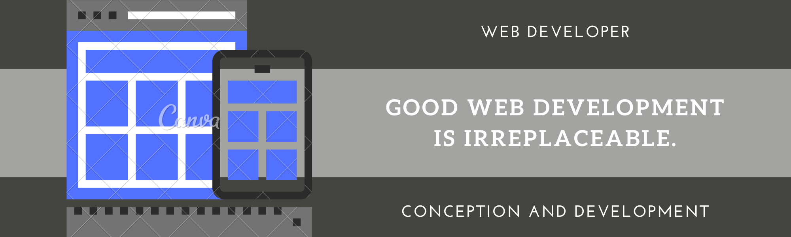

- 👋 Hi, I’m @HarounSalhi
- 👀 I’m interested in ...
- 🌱 I’m currently learning ...
- 💞️ I’m looking to collaborate on ...
- 📫 How to reach me ...

<!--

-->

<!-- Actual text -->

You can find me on [![Twitter][1.2]][1], or on [![LinkedIn][2.2]][2].

<!-- Icons -->

[1.2]: http://i.imgur.com/wWzX9uB.png (twitter icon without padding)
[2.2]: https://raw.githubusercontent.com/MartinHeinz/MartinHeinz/master/linkedin-3-16.png (LinkedIn icon without padding)

<!-- Links to your social media accounts -->

[1]: https://twitter.com/Martin_Heinz_
[2]: https://www.linkedin.com/in/heinz-martin/

<!---
HarounSalhi/HarounSalhi is a ✨ special ✨ repository because its `README.md` (this file) appears on your GitHub profile.
You can click the Preview link to take a look at your changes.
--->

